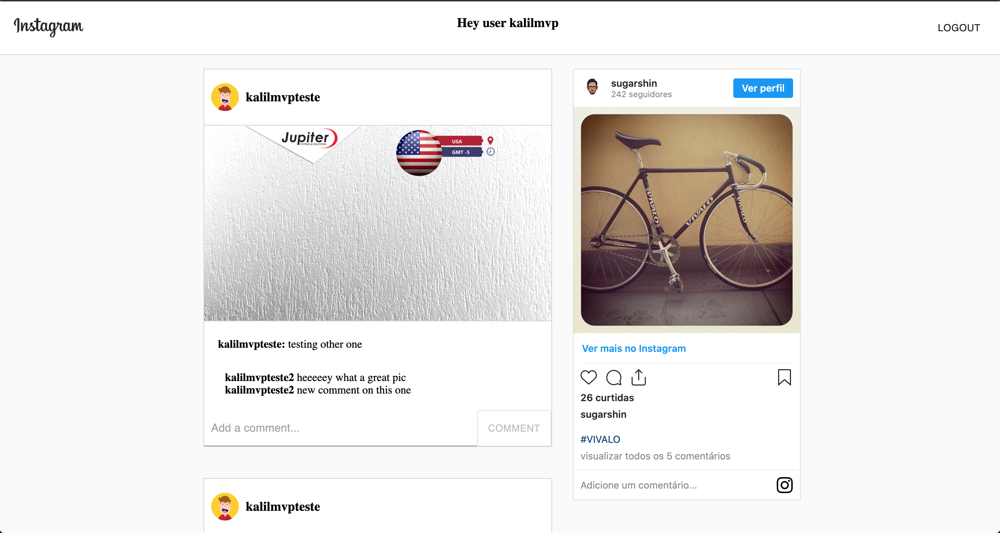

# 

<br/>
  
> Simple Instagram Feed Clone

To run the app, you need to configure your firebase account, hook the firestore service and change the /utils/firebase.ts with your configuration provided, after that just execute this command:
<br />

```
yarn
yarn start
```

Technologies used

- React JS
- Material UI
- Firebase Auth
- Firebase Storage
- Firebase DB